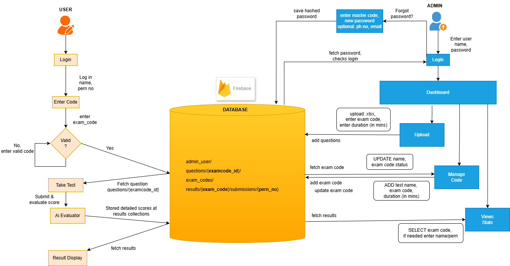
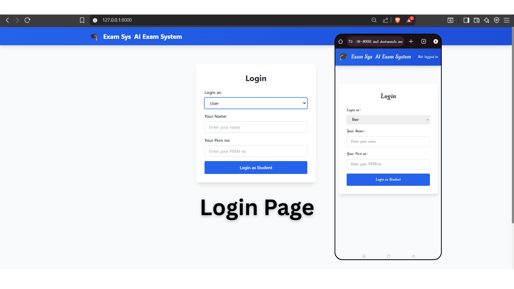
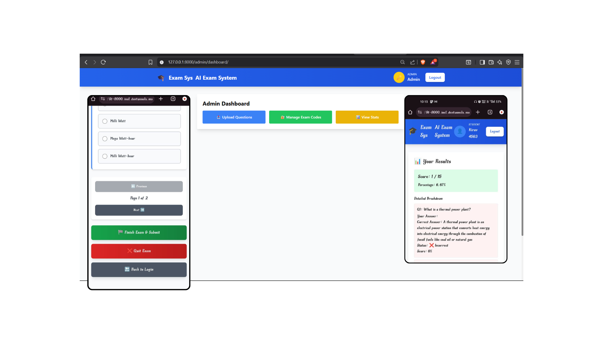
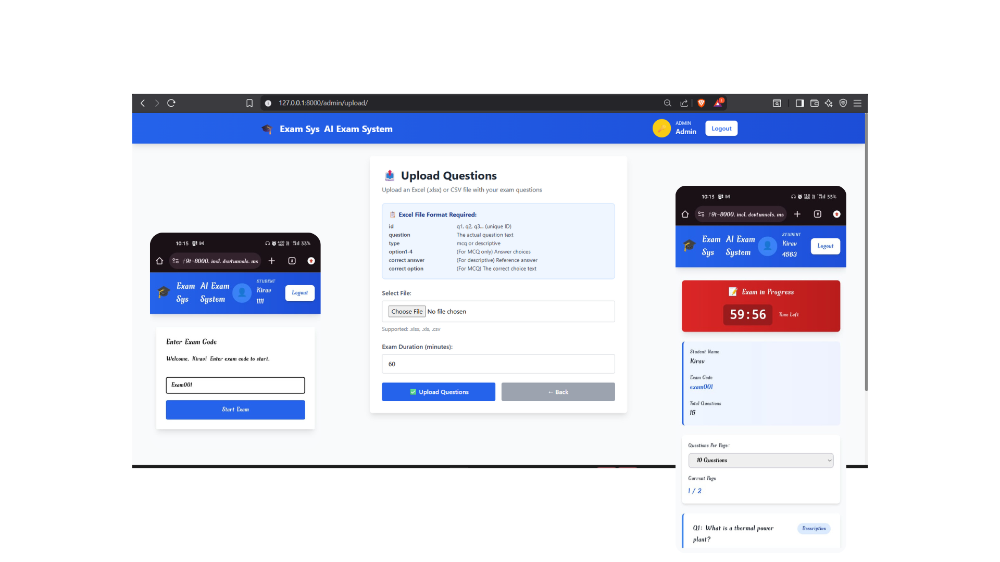
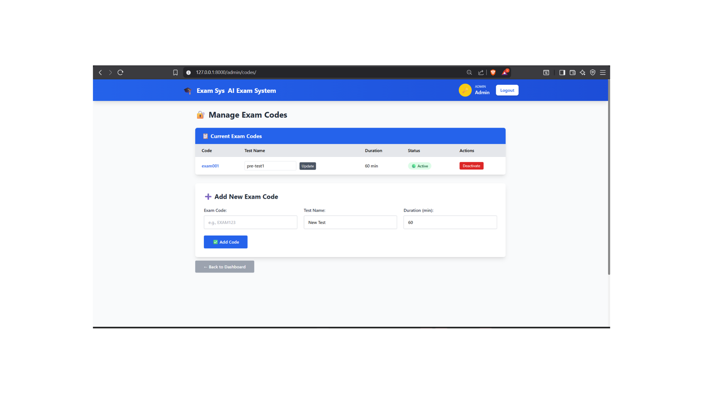
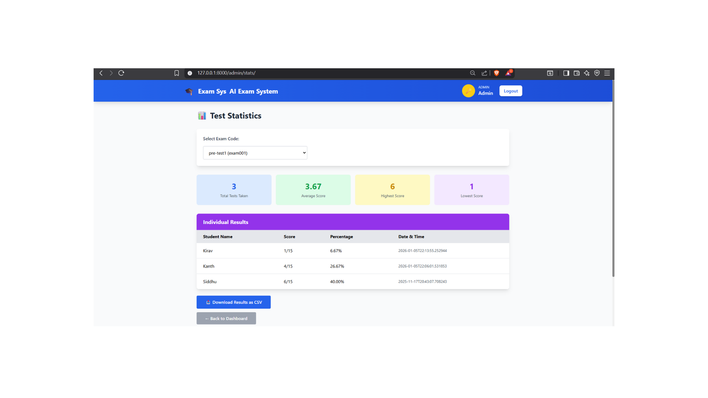

# ExamSys

ExamSys is an AI-powered online examination system built with Django backend and Firebase Firestore database. It allows administrators to create and manage exams, upload questions, evaluate student answers automatically using AI models, and view detailed analytics. Students can securely take exams, submit answers, and view results.


---

## Features

- Secure Admin and Student login with session management
- Admin Dashboard to upload exam questions (Excel/CSV)
- Dynamic exam code creation and activation/deactivation
- AI-powered automated evaluation of MCQ and descriptive answers
- Persistent admin credential management in Firestore with password reset
- Student exam workflow with exam code and timed sessions
- Real-time analytics and downloadable results for admins
- Responsive UI styled with Tailwind CSS

---

## Technologies Used

- Django (Python) for backend and server-side logic  
- Firebase Firestore as NoSQL cloud database  
- Tailwind CSS for frontend styling  
- Pandas for processing bulk question uploads  
- Python Flask for AI-based answer evaluation microservice  
- JavaScript for interactive UI components

---

## Getting Started

### Prerequisites

- Python 3.8 or higher  
- Firebase account with Firestore enabled  
- Git installed on your system  

### Installation Instructions

1. **Clone the repository**

git clone https://github.com/Bhargav-567/ExamSys.git
cd ExamSys


2. **Create and activate a virtual environment**

python -m venv venv
venv\Scripts\activate


3. **Install dependencies**

  ```plaintext

    pip install -r requirements.txt

  ```

- Model for spacy
  ```plaintext

  pip install https://github.com/explosion/spacy-models/releases/download/en_core_web_sm-3.7.0/en_core_web_sm-3.7.0-py3-none-any.whl


  ```


4. **Configure Firebase**

- Place your Firebase service account JSON in the project, update your `firebase_config.py` accordingly  
- Ensure Firestore database rules allow read/write as configured for your app

5. **Run the Django server**

python manage.py migrate

python manage.py runserver


6. **Open your browser**

Navigate to http://localhost:8000 to access the system.

---

## Project Structure

```plaintext

exam_sys/
├── manage.py
├── examsys/                    # Main Django app
│   ├── __init__.py
│   ├── settings.py
│   ├── urls.py                 # Routes: login, admin_upload, submit_exam, etc.
│   └── wsgi.py
├── examsys_app/                # Your app folder
│   ├── __init__.py
│   ├── admin.py
│   ├── apps.py
│   ├── models.py               # UNUSED (pure Firestore)
│   ├── views.py                # ✅ MAIN: All functions (updated above)
│   ├── urls.py
│   ├── firebase_config.py      # db = firestore.client()
│   ├── ai_service.py           # evaluate_answer() → hybrid wrapper
│   ├── grader.py               # ✅ NEW: DescriptiveAnswerGrader class
│   │   ├── Concept dataclass
│   │   ├── QuestionConfig
│   │   └── compute_concept/relations/semantic/penalty
│   └── templates/              # HTML
│       ├── login.html
│       ├── admin_upload.html
│       ├── admin_stats.html    # ✅ Search UI
│       ├── take_exam.html
│       └── results.html
├── static/                     # CSS/JS (search modal)
├── requirements.txt            # firebase-admin, pandas, sentence-transformers, spacy
└── serviceAccountKey.json      # Firestore credentials
```


## FireStore Database Schema

```plaintext

Firestore Root
├── exam_codes/
│   └── {exam_code_id}           # Document ID = TEST001
│       ├── test_name: "Midterm"
│       ├── duration: 60
│       └── active: true
│
├── questions/
│   ├── config                   # Summary document for the student exam logic
│   │   ├── questions: [ {id, question, type, teacher_answer, max_score, concepts: [...]} ]
│   │   ├── total_questions: 5
│   │   └── updated_at: Timestamp
│   └── {q_id}                   # Individual question docs (optional, but good for modularity)
│       ├── question: "..."
│       ├── type: "descriptive"
│       └── concepts: [ {name: "plants", keywords: ["plant", "plants"]} ]
│
└── results/                     # Top-level collection
    └── {exam_code}/             # Document per exam (e.g., TEST001)
        └── submissions/         # Sub-collection for all student attempts
            └── {pern_no}/       # Document ID = Student PERN (e.g., 12345)
                ├── student_name: "John"
                ├── pern_no: "12345"
                ├── total_score: 28.5
                ├── total_max_score: 50.0
                ├── percentage: 57.0
                ├── timestamp: Timestamp
                └── details: [   # Detailed per-question breakdown
                    {
                        "q_id": "Q1",
                        "score": 8.2,
                        "your_answer": "Plants need sunlight...",
                        "details": {
                            "type": "Descriptive",
                            "teacher_answer": "...",
                            "max_score": 10.0,
                            "concept_score": 0.75,
                            "semantic_similarity": 0.82,
                            "relation_score": 0.67,
                            "penalty": 0.05
                        }
                    }
                ]
```

## Flow Diagram



---


## Usage

- **Admin:**  
  - Login with admin credentials  
  - Upload exam questions via the dashboard  
  - Create, activate, and deactivate exam codes  
  - Reset admin password securely with register code verification  
  - View analytics and download student results  

- **Student:**  
  - Login with name  
  - Enter exam code to take exams within the allocated time  
  - Submit answers including descriptive questions for AI evaluation  
  - View detailed results with score analytics  

---


## Sample Screenshots
### Login Page:
 - an User can Login as Student or an Admin with his credentials.
<div style="text-align: center;">
  
</div>

## Excel question sheet Format:
 - Make sure that the question excel sheet is in format shown below.
<div style="text-align: center;">
  
</div>

| Column           | Purpose                           | Example (Q21)                |
| ---------------- | --------------------------------- | ---------------------------- |
| **Q ID**         | Unique question ID                | `Q21`                        |
| **Type**         | `'descriptive'` / `'mcq'` | `descriptive`             |
| **Question** | Question to be displayed | `"Explain how power generated in..."` |
| **Teacher_Answer** | Reference answer (descriptive) / Correct option(s) | `"Steam turbine generates..."` |
| **Concept_Names** | Comma-separated concepts         | `boiler drum,economizer`     |
| **Concept_Keywords** | Semicolon-separated keyword lists | `boiler,drum;economizer, heat transfer`   |
| **Options**    | If MCQ, provides options seperated by ;          |  `cold water;hot water;hot steam;None of the Above.`    |
| **Max_Score**    | Points (e.g., 10.0)               | `10.`                       |


### Admin Page
- After admin logged in, He can upload a Test question.excel file in above excel format with Exam session duration.
- Admin can create 'Exam code', Activate it, Deactivate it.
- Admin can view the stats of the Exam results by its *Exam code* and can *Download it*. 
<div style="text-align: center;">
  
</div>

### Test Upload Page:
 - After Admin logged in, He can upload a Test question.excel/csv file in excel format with Exam session duration.
<div style="text-align: center;">
  
</div>


### Exam Code:
 - The student has to enter the 'Exam code', that is already uploaded and announced by the admin.
<div style="text-align: center;">
  
</div>


### Result Page:
 - The student attempt the question, Click on the 'Finish & submit' to save answer
 - Student also get response regarding his exam result.
<div style="text-align: center;">
  
</div>

---

## Note:
- Due to the firestore secret key presence, It has to be set up firstly before the backend connection.

---

## Deployment

- Deploy on any platform supporting Python and Firebase such as Heroku, AWS, Google Cloud, or your own server  
- Use environment variables or secret management for Firebase credentials and Django secret key  
- Use production-grade database rules and HTTPS for secure operation

---

## Contributing

Contributions are welcome! Please fork the repository, make your changes, and create a pull request.

---

## Contact

For any queries or feature requests, please open an issue or reach out to the boddepallibhargav363@gmail.com.


